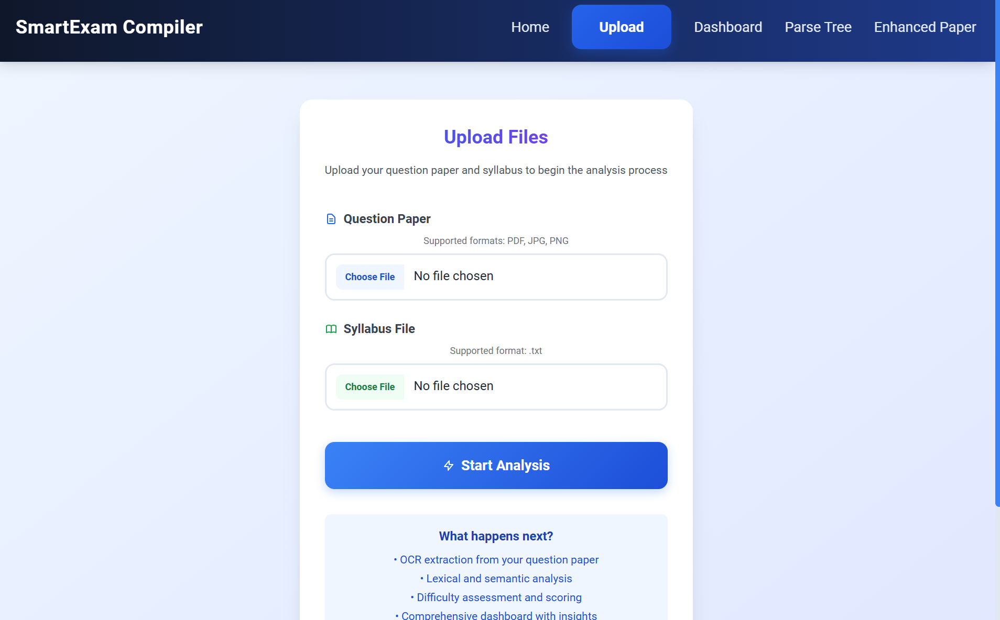
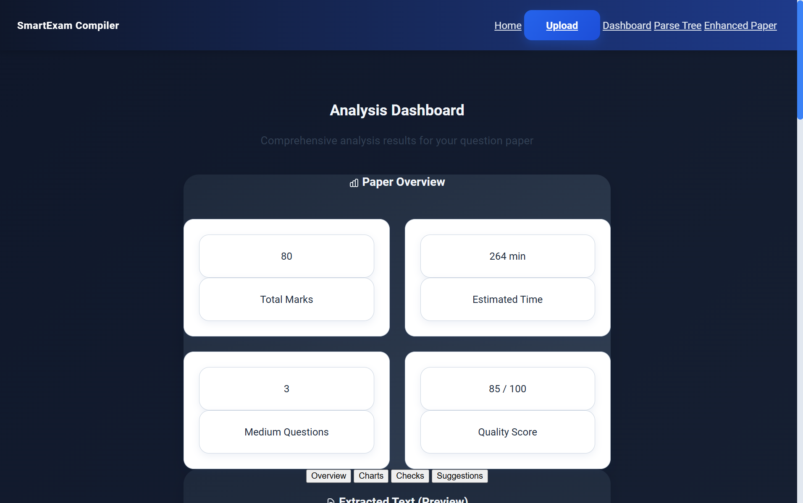
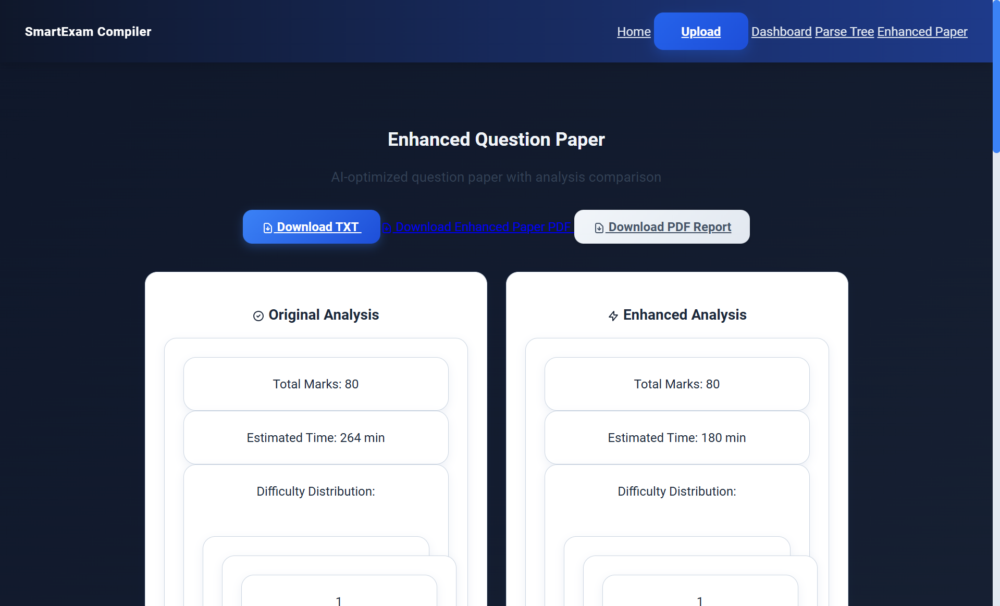
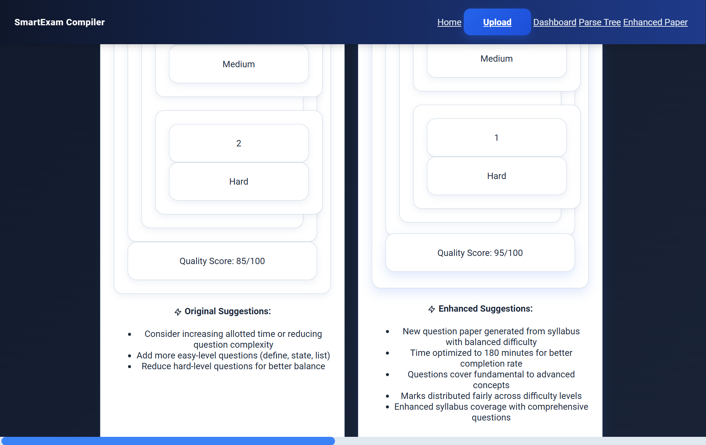
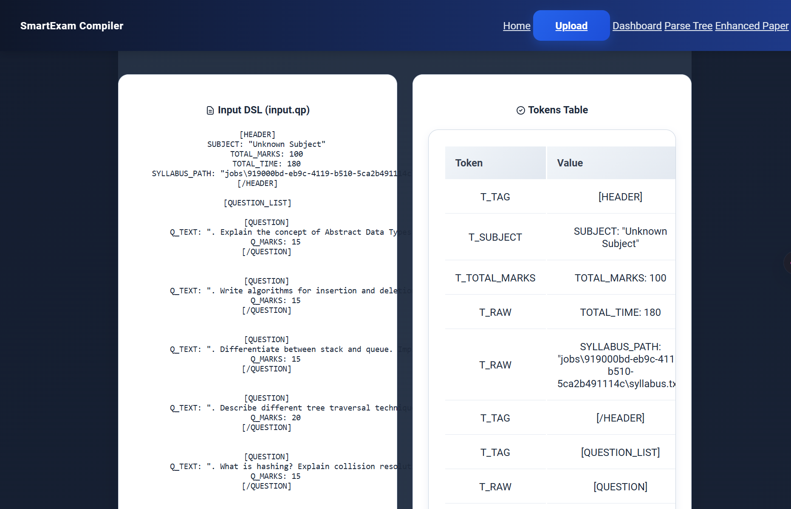
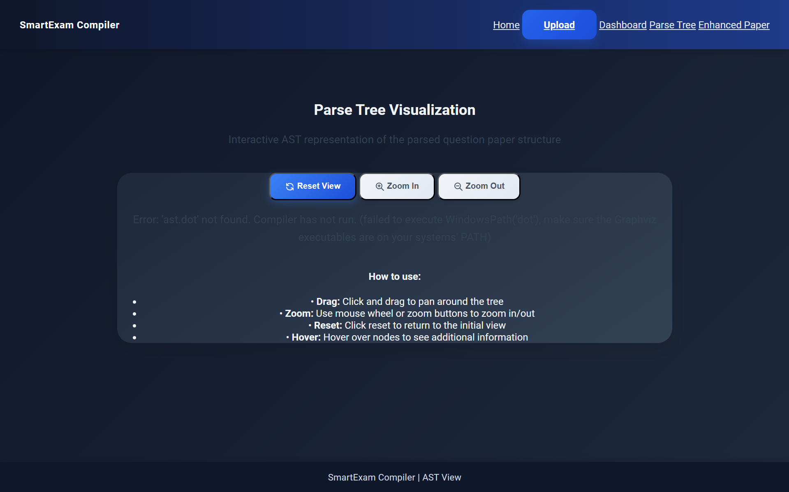
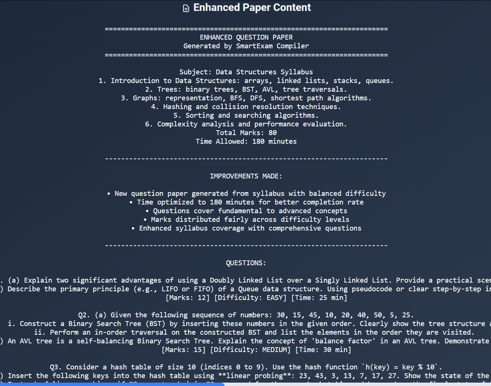
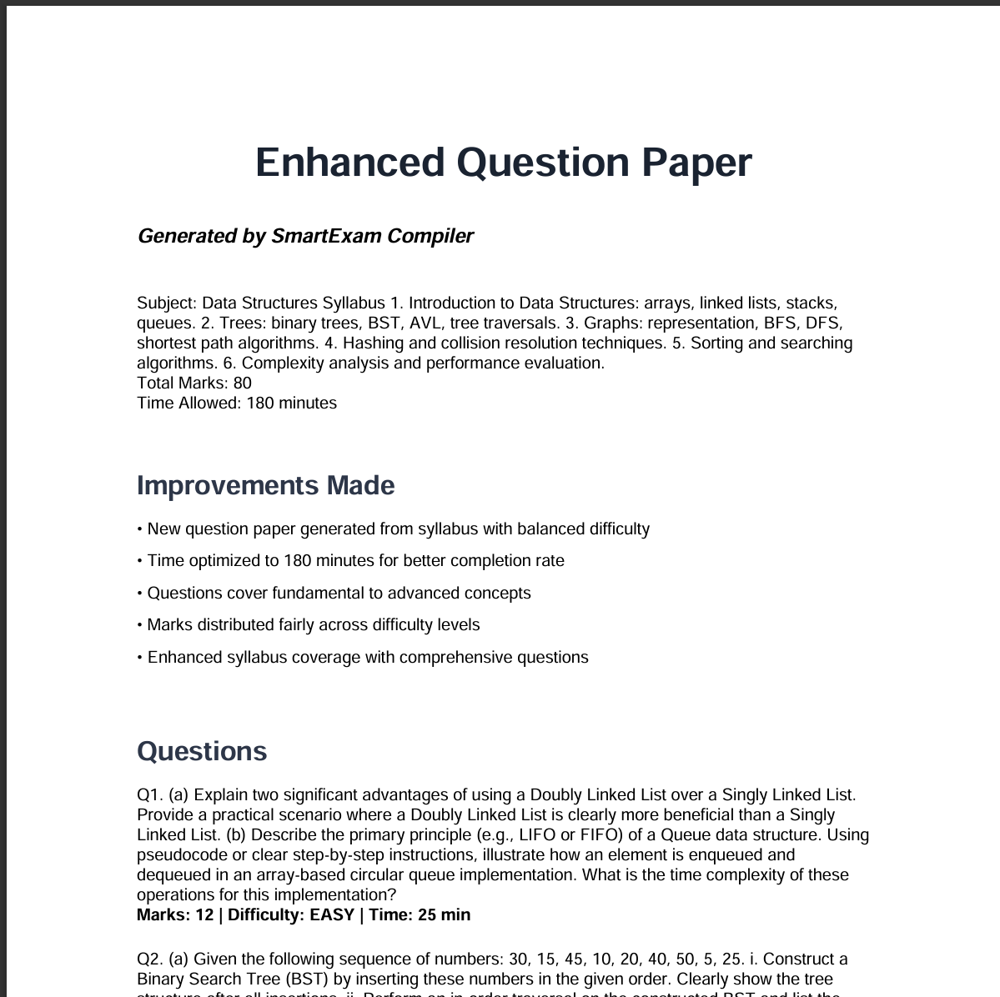

# SmartExam Compiler

## AI-Driven Question Paper Analyzer

[](https://www.python.org/)
[](https://flask.palletsprojects.com/)
[](https://fastapi.tiangolo.com/)


A comprehensive compiler design project that automates the analysis and validation of academic question papers using AI-powered OCR, custom DSL parsing, and semantic analysis.

## 🎯 Problem Statement

Creating question papers for exams is still largely manual. Teachers and academic staff type questions into Word or LaTeX, tally marks in their heads, and try to ensure syllabus coverage, balance of difficulty, and correctness of answer keys. This manual process is error-prone:

- Totals don't always add up to the declared marks
- Questions are sometimes repeated or skipped
- Topics may be over- or under-represented
- MCQs occasionally have more than one correct answer
- Answer keys can be missing or inconsistent
- The estimated time to solve a paper doesn't always match the scheduled exam duration

These mistakes cause confusion, unfair assessments, and rework. They waste time for staff and hurt students' trust in exams.

There is no easy way to validate a paper before it goes live, especially across multiple departments and campuses. Existing quiz platforms focus on delivery, not on checking the content.

## 🚀 Proposed Solution

We propose building a Question Paper Compiler — a software tool, based on Lex and Yacc, that takes a structured text representation of an exam paper and "compiles" it: parsing, validating, and reporting on its quality, just like a compiler does for source code.

The core of the system is a simple domain-specific language (DSL) for exams. For example:

```
Exam: Compiler Design Midterm
TotalMarks: 50
Duration: 90 min
Syllabus: Lexical Analysis, Parsing, Semantics

Q1 [MCQ] (2 marks) Topic: Lexical Analysis Difficulty: Easy
Correct: b
Options:
a. Regular expressions are ...
b. DFA accepts only ...
c. NFA requires ...
d. Compiler back-end is ...
---

Q2 [Short] (5 marks) Topic: Parsing Difficulty: Medium
Correct: Any valid example of LL(1) grammar
---
```

The compiler will:

- **Lexical Analysis**: Break the text into tokens (Exam title, questions, options, marks, etc.)
- **Parsing**: Check that the paper follows the DSL grammar (correct ordering, fields present, syntax valid)
- **Semantic Analysis**: Apply academic rules, for example:
  - Ensure marks add up to the declared total
  - Ensure all syllabus topics are covered
  - Ensure difficulty distribution meets set ratios
  - Flag duplicate or near-duplicate questions
  - Validate MCQs have a single correct option
  - Check the sum of estimated times fits within the declared exam duration
- **Reporting**: Produce a human-readable report with errors, warnings, and summaries

## ✨ Screenshots
!(static/images/upload_page.png)
### Upload Page

*The main interface for uploading question papers and syllabus files*

### Dashboard Overview

*Comprehensive analysis dashboard showing question paper statistics and validation results*

### Analysis Charts


*Interactive charts displaying difficulty distribution, marks breakdown, and time analysis*

### Lexical Analysis

*Token analysis view showing the lexical breakdown of the processed question paper*

### Parse Tree Visualization

*Abstract Syntax Tree (AST) visualization of the parsed question paper structure*

### Enhanced Paper Generation


*AI-generated enhanced question paper with improved clarity and balance*


## ✨ Features

### Core Functionality
- **OCR Text Extraction**: Powered by Google Vision API for accurate text extraction from PDFs and images
- **AI-Powered Preprocessing**: Intelligent text cleaning and formatting using NLP techniques
- **Custom DSL Compiler**: Lex/Yacc-based parser for question paper validation
- **Semantic Analysis**: Comprehensive academic rule checking and quality assessment
- **Enhanced Paper Generation**: AI-driven suggestions for improved question papers
- **Web Dashboard**: Modern Flask-based UI with interactive visualizations
- **REST API**: FastAPI endpoints for programmatic access

### Analysis Capabilities
- Question validation and error detection
- Marks calculation and verification
- Difficulty distribution analysis
- Syllabus coverage assessment
- Time estimation and validation
- Duplicate question detection
- Crispness analysis for question clarity

### Output Formats
- Interactive web dashboard with charts
- JSON reports for semantic analysis
- PDF reports with visualizations
- Enhanced question paper generation
- Parse tree visualization (AST)
- Token analysis display

## 🏗️ Architecture

The system follows a **Controller-Worker** architecture with multiple processing phases:

```
┌─────────────────┐    ┌─────────────────┐    ┌─────────────────┐
│   Web Interface │    │     REST API    │    │   File Upload   │
│    (Flask)      │    │   (FastAPI)     │    │                 │
└─────────────────┘    └─────────────────┘    └─────────────────┘
         │                       │                       │
         └───────────────────────┼───────────────────────┘
                                 │
                    ┌─────────────────────┐
                    │   Phase 0: OCR &    │
                    │   Preprocessing     │
                    │ - Google Vision API │
                    │ - Text Cleaning     │
                    │ - DSL Formatting    │
                    └─────────────────────┘
                                 │
                    ┌─────────────────────┐
                    │   Phases 1-6:       │
                    │   Compilation       │
                    │ - Lexical Analysis  │
                    │ - Parsing           │
                    │ - Semantic Analysis │
                    │ - Code Generation   │
                    └─────────────────────┘
                                 │
                    ┌─────────────────────┐
                    │   Phase 7: Reports  │
                    │ - Dashboard Data    │
                    │ - Enhanced Papers   │
                    │ - PDF Generation    │
                    └─────────────────────┘
```

### Key Components

- **`app.py`**: Main Flask application with web routes
- **`analysis/`**: AI/ML processing modules (OCR, preprocessing, synthesis)
- **`compiler/`**: C/C++ compiler implementation (lexer, parser, semantic analysis)
- **`templates/`**: HTML templates for web interface
- **`static/`**: CSS, JavaScript, and assets
- **`jobs/`**: Processing job directories
- **`output/`**: Generated reports and files

## 📋 Prerequisites

- Python 3.8+
- C/C++ compiler (GCC/Clang)
- Google Cloud Vision API credentials
- Tesseract OCR (optional fallback)
- Node.js (for additional tooling)

## 🚀 Installation

1. **Clone the repository:**
   ```bash
   git clone https://github.com/bhargav-sai-tanguturi/smartexam-compiler.git
   cd smartexam-compiler
   ```

2. **Install Python dependencies:**
   ```bash
   pip install -r requirements.txt
   ```

3. **Set up Google Cloud credentials:**
   - Obtain a Google Cloud service account key
   - Set the environment variable:
     ```bash
     export GOOGLE_APPLICATION_CREDENTIALS="path/to/your/service-account-key.json"
     ```
   - Or place the key file in `api key/` directory

4. **Configure Gemini AI:**
   ```bash
   export GEMINI_API_KEY="your-gemini-api-key"
   ```

5. **Build the C/C++ compiler:**
   ```bash
   cd compiler
   make
   cd ..
   ```

6. **Run setup scripts:**
   ```bash
   ./setup.sh
   ```

## 💻 Usage

### Web Interface

1. **Start the Flask application:**
   ```bash
   python app.py
   ```

2. **Open your browser:**
   - Navigate to `http://localhost:5000`
   - Upload a question paper (PDF/image) and syllabus file
   - View analysis results in the interactive dashboard

### API Usage

1. **Start the FastAPI server:**
   ```bash
   uvicorn analysis.api:app --reload
   ```

2. **API Documentation:**
   - Interactive docs: `http://localhost:8000/docs`
   - Alternative docs: `http://localhost:8000/redoc`

### Command Line

```bash
# Run compiler directly
python compiler/q_compiler.py <job_directory>

# Test OCR extraction
python -c "from analysis.ocr_extract import extract_text_from_file; print(extract_text_from_file('path/to/file.pdf'))"
```

## 📚 API Documentation

### Core Endpoints

#### OCR Extraction
```http
POST /extract-text/
```
Upload a file for text extraction using Google Vision API.

#### Full Pipeline Processing
```http
POST /process-paper/
```
Complete processing pipeline: OCR → Preprocessing → Compilation → Enhanced Paper Generation.

#### Retrieve Results
```http
GET /job/{job_id}/enhanced-paper
GET /job/{job_id}/semantic-report
GET /job/{job_id}/dashboard
```

## 📁 Project Structure

```
smartexam-compiler/
├── analysis/                 # AI/ML processing modules
│   ├── api.py               # FastAPI server
│   ├── ocr_extract.py       # Google Vision OCR
│   ├── preprocess.py        # Text cleaning & DSL formatting
│   ├── synthesis.py         # Enhanced paper generation
│   ├── semantic_analysis.py # Academic rule validation
│   └── ...
├── compiler/                # C/C++ compiler implementation
│   ├── lexer.l             # Lex specification
│   ├── parser.y            # Yacc grammar
│   ├── q_compiler.py       # Python wrapper
│   ├── ast_helpers.c       # AST utilities
│   └── ...
├── templates/              # HTML templates
│   ├── index.html          # Main dashboard
│   ├── upload.html         # File upload interface
│   ├── dashboard.html      # Analysis results
│   └── ...
├── static/                 # Web assets
│   ├── images/             # Screenshots and assets
│   ├── styles.css          # CSS stylesheets
│   ├── scripts.js          # JavaScript files
│   └── ...
├── jobs/                   # Processing job directories
├── output/                 # Generated reports and files
├── config/                 # Configuration files
├── data/                   # Sample data and test files
├── requirements.txt        # Python dependencies
├── app.py                  # Main Flask application
├── setup.sh                # Setup script
└── README.md               # This file
```

## 🤝 Contributing

We welcome contributions! Please follow these steps:

1. Fork the repository
2. Create a feature branch: `git checkout -b feature/your-feature`
3. Commit your changes: `git commit -am 'Add your feature'`
4. Push to the branch: `git push origin feature/your-feature`
5. Submit a pull request

### Development Guidelines

- Follow PEP 8 for Python code
- Use meaningful commit messages
- Add tests for new features
- Update documentation as needed
- Ensure all tests pass before submitting

## 📄 License

This project is licensed under the MIT License - see the [LICENSE](LICENSE) file for details.

## 🙏 Acknowledgments

- Google Cloud Vision API for OCR capabilities
- Google Generative AI (Gemini) for enhanced analysis
- Lex & Yacc for compiler foundation
- Flask and FastAPI communities

## 📞 Support

For questions or issues:
- Open an issue on GitHub
- Check the documentation
- Review the TODO.md for current development status

---

**Built as a Compiler Design Course Project**  
*Empowering educators with automated question paper validation*
